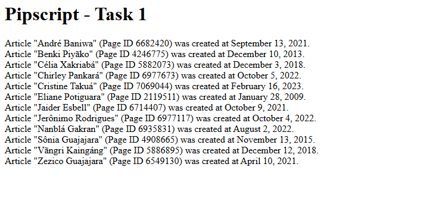

# Outreachy Task 1 (T418285)

**Program:** Outreachy Round 32  
**Organization:** Wikimedia Foundation

**Task:** Outreachy 32: Addressing the lusophone technological wishlist proposals - Create a JavaScript script to manipulate a json object and print it in a human legible format (T418285)

## What This Does

Takes a JSON array of Wikipedia article metadata and renders each entry
into a human-readable sentence inside an HTML page, like so:

> Article "André Baniwa" (Page ID 6682420) was created at September 13, 2021.

## Output

